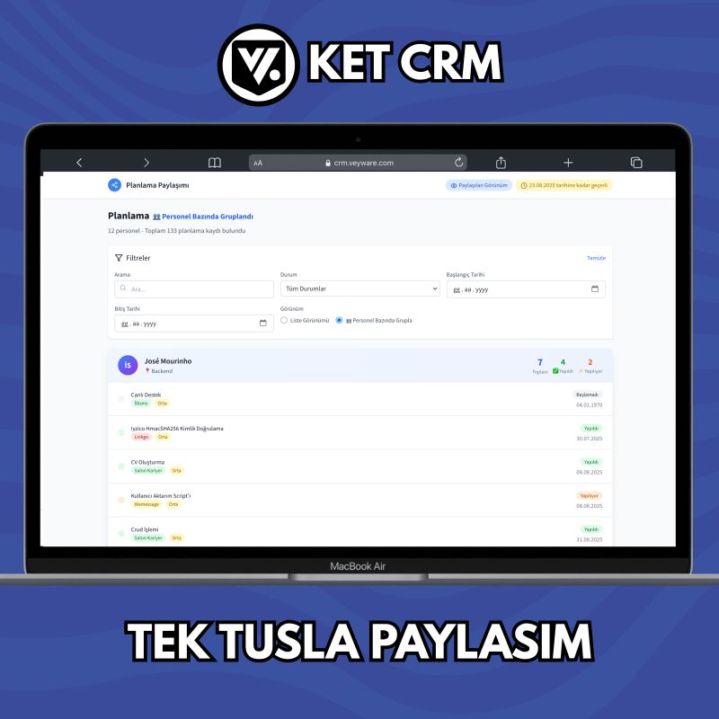
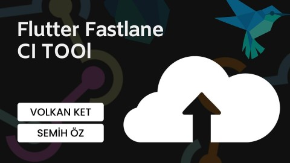

# Hi, I'm Volkan 👋

💻 **Flutter Developer | Backend with Node.js | Frontend with React | Project Manager**

---

## 🚀 About Me  
Currently, I’m working as a **Flutter Developer**, building mobile applications.  
I also develop **backends with Node.js** and **frontends with React**.  
In addition, I’m actively working as a **Project Manager**.  

I’m passionate about learning new technologies, building scalable applications, and creating value together with teams.  

---

## 📝 LinkedIn Posts  

Here are some of my LinkedIn posts where I shared insights from my projects and development journey:  

  <a href="https://www.linkedin.com/posts/ketvolkan_ketcrm-projeyaemnetimi-crm-activity-7362556471596716032-PSSz">
    

      <b>KetCRM | Project Management CRM</b> 
      
    

  </a>
 
  <a href="https://www.linkedin.com/posts/ketvolkan_flutterda-i%CC%87%C3%A7-i%CC%87%C3%A7e-navigatora-son-getx-ile-activity-7335814265653592065-9Ca_">
    

      <b>Flutter Nested Navigator with GetX</b> 
      
    

  </a>
   
  <a href="https://www.linkedin.com/posts/ketvolkan_flutter-upload-ci-tool-activity-7100854345163767808-umMF">
    

      <b>Flutter Upload CI Tool</b> 
      
    

  </a>

---

## 📱 Flutter Projects  

### Salon Randevu, En Randevu, Salon Management  
Among the applications I developed for the company I work for, there is a salon management app that handles  
appointment scheduling, order management, and accounting. Since there are different customer profiles, we created three  
separate solutions from a single app. You can find more details about this system in the posts I've shared on my LinkedIn  
profile.  

---

### Wamessage | Bulk WhatsApp Messaging  
A version of the SMS app that enables sending bulk messages via WhatsApp.  

---

### Vayonet | Site Management  
An app that allows apartment managements to handle tasks such as collecting dues and sharing announcements.  

---

### Couple | Keep Your Memories  
The app I developed as my own venture, where I wrote both the backend and the mobile side myself, allows couples to  
share and track their special days and memories with each other.  

---

### VatanSms Net, VatanSms Com, ZorluSms, TopluSms  
Bulk SMS sending apps for businesses, institutions, and communities in Turkey. Customers can easily send pre-prepared  
SMS messages with personalized titles to their recipients.  

---

## 📊 GitHub Stats  

  

  

  

---

## 🔗 Contact Me  
  
  
  
